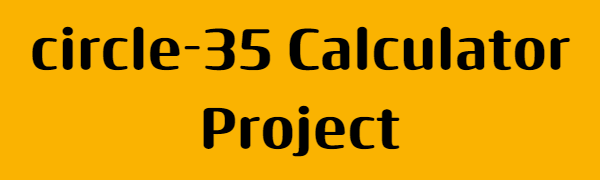

# Group JavaScript Calculator Project 

Leveraging AltSchool circles, we are to build a very basic calculator with Javascript.

## Prerequisites
What is required of you to contribute to this project:

* Familiarity with Git and the command line.
* Experience with GitHub and collaboration with GitHub.
---
## Technologies
* HTML [Hyper Text Markup Language] - Markup language used to create the skeleton of our calculator.
* CSS  [Cascading Style Sheet] - Responsible for the appearance of our calculator.
* JavaScript - To add functionalities to our calculator.

## Features
* Basic arithmetic calculations.
* Toggle between Light and Dark mode.

## Contributing

Please, read [CONTRIBUTING.md](CONTRIBUTING.md) for details on how to collaborate on this project.

## Contributors

The list of contributors who participated in this project.

* **Abdulsalam Baruwa** - *Maintainer* - [GitHub profile](https://github.com/dmystical-coder)

## License

This project is licensed under the MIT License - see the [LICENSE.md](LICENSE.md) file for details.

## Acknowledgements

* Design inspiration from [Rafaela Lucas daily UI challenge](https://rafaelalucas.com/dailyui/4/) - [Rafaela Lucas](https://rafaelalucas.com/)